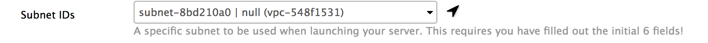

```{r style, echo = FALSE, results = 'asis'}
options(width=100)
knitr::opts_chunk$set(
    eval=as.logical(Sys.getenv("KNITR_EVAL", "TRUE")),
    cache=as.logical(Sys.getenv("KNITR_CACHE", "TRUE")))
```


NOTE: We assume the user has a AWS secret key and access key.

# Instructions of how to launch your own Bioconductor AMI

1. Go to http://54.175.111.96/launch

2. Use the default cloud, `Amazon (AWS EC2)` and enter your `Access key` and `Secret Key`.

3. Give your cluster a name, any name  eg: *joe-cluter* and give it a password which you will use to access that cluster via ssh.

4. Choose an `Instance type` from the available list of instances.

5. Expand the Advanced options section, and choose `Subnet IDs`. Click the arrow to fetch the available submets on your VPC (if available).



6. Click `Create cluster` to Launch the AMI.


An example screen shot of what your page should look like is given below so that you are on the right track.


